<h1 align="center">Hi 👋, I'm Thant Zin Oo</h1>
<h3 align="center">Aspiring Full-stack Web Developer | Flutter Developer | Data Enthusiast</h3>

  

---

### 👨‍💻 About Me

I am currently working as an **Application Support Specialist** in the IT Department at **Alliance Microfinance for Myanmar**.

My career direction is to grow from application support into a strong **Software Developer** and **Data Analyst**.

I am focusing on:

- **Full-stack Web Development** with `Next.js`, `Java Spring Boot`, and `PostgreSQL`
- **Mobile Development** with `Flutter` and `Dart`
- **Backend fundamentals** with `Node.js`, `Express.js`, REST API, and database design
- **Data Analysis** with `SQL`, `Excel`, `Python`, and `Tableau`
- **Enterprise Application Support**, troubleshooting, issue follow-up, and vendor coordination

I enjoy learning by building real projects, fixing issues, and improving step by step.

---

### 🎯 Current Focus

- Improving my **Next.js + TypeScript** project structure
- Learning **Java Spring Boot** for backend development
- Practicing **Node.js + Express.js** backend basics
- Strengthening **SQL, Python, Excel, and Tableau** for data work
- Building projects that connect frontend, backend, database, and real business workflows

---

### 🚀 Tech Stack

#### Frontend

#### Mobile

#### Backend & Database

#### Data

---

### 📌 Featured Projects

| Project | Type | Tech Stack | Notes |
| --- | --- | --- | --- |
| [**Health-Mate**](https://github.com/thantzinoo-dev/Health-Mate) | Mobile health app | `Flutter`, `Dart`, `BLoC`, `Firebase`, `Firestore`, `SQLite` | Feature-rich Flutter project with authentication, local persistence, media, health features, and Firebase services. |
| [**ngavitt**](https://github.com/thantzinoo-dev/ngavitt) | COVID tracker app | `Flutter`, `Dart`, `Provider`, `HTTP`, `Charts` | Earlier Flutter project focused on API usage, state management, data display, and UI practice. |
| **Hotel Administration System** | School project / admin system | `Next.js`, `TypeScript`, `Prisma`, `PostgreSQL`, `Tailwind CSS`, `Zustand` | Private academic project for rooms, guests, bookings, payments, reports, and admin workflows. |
| [**React-POS-App**](https://github.com/thantzinoo-dev/React-POS-App) | POS web app | `React`, `Vite`, `JavaScript`, `Tailwind CSS`, `Zustand`, `SWR` | Frontend business workflow project for sales, UI state, forms, printing, and POS interaction practice. |
| **fbhacker** | Legacy security learning repo | `Security learning`, `Ethical use only` | Older learning repository kept as a record. I focus on ethical learning, security awareness, and responsible development only. |

---

### 📈 GitHub Analytics

  

  
  

  
  

  

  

The five summary cards are generated as local SVG files by GitHub Actions and refreshed daily. Public statistics are shown unless a private-access token is configured.

---

### 🌱 Learning Roadmap

- `Next.js App Router` for full-stack frontend development
- `Java Spring Boot` for enterprise backend development
- `Node.js` and `Express.js` for backend fundamentals
- `PostgreSQL` and `MS SQL Server` for database work
- `Python`, `SQL`, `Excel`, and `Tableau` for data analysis
- System design basics and real-world application support workflows

---

### 📫 Connect with Me

  <a href="https://github.com/thantzinoo-dev">GitHub</a>

